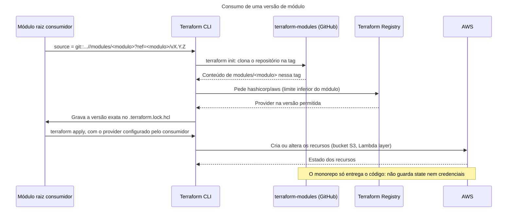

# Arquitetura: monorepo de módulos Terraform

## Resumo

Este repositório é um catálogo pessoal e genérico de módulos Terraform reutilizáveis, independente de empresa. Ele não implanta nada e não tem nada em execução. O que ele entrega são versões de módulo: cada versão é uma tag `<modulo>/vX.Y.Z` na `main`, e quem consome fixa essa tag no `source` do módulo. Cada módulo tem a própria versão e o próprio `CHANGELOG.md`. Hoje são dois módulos, `aws_s3_bucket` e `aws_lambda_layer_version`, os dois na versão 0.1.0.

Responsável pelo repositório: @FWesleycosta.

## Contexto: quem usa o monorepo e com o que ele se relaciona

O diagrama mostra o monorepo como uma caixa só, com as pessoas e os sistemas em volta dele. O GitHub Actions e o GitHub Releases não aparecem aqui porque fazem parte do próprio monorepo: são o workflow `ci` e as releases, abertos no diagrama de contêineres. Observe duas coisas. Primeiro, a AWS só se liga aos consumidores: o monorepo, inclusive o CI, nunca acessa uma conta de nuvem. Segundo, os consumidores ainda não existem; hoje, quem usa os módulos são os exemplos em `modules/<modulo>/examples/`.

![Diagrama C4 de contexto do terraform-modules, com seis elementos. O responsável abre PRs, faz o merge, cria tags e releases no terraform-modules, por Git, GitHub e gh. O Dependabot, que atualiza toda semana os SHAs das GitHub Actions, abre PRs que atualizam as Actions, pelo GitHub. O terraform-modules baixa os providers do Terraform Registry ao validar cada PR, com terraform init -backend=false. Os módulos raiz consumidores baixam o módulo pela tag, por Git via SSH ou HTTPS, baixam os providers do Terraform Registry e criam os recursos na AWS. Nenhuma relação liga o terraform-modules à AWS.](../diagramas/c4-contexto.drawio.png)

| Elemento | Papel | Evidência |
|---|---|---|
| Responsável | Mantém os módulos, faz o merge dos PRs e cria as tags e as releases | `README.md`, seção "Versionamento"; runbook [Publicar uma versão de módulo](../runbooks/publicar-versao-de-modulo.md) |
| `terraform-modules` | Repositório público no GitHub (`FWesleycosta/terraform-modules`) com os módulos. Valida cada PR no GitHub Actions e entrega versões de módulo; cada versão é uma tag com release | `README.md`, linhas 3, 18 e 27; `.github/workflows/ci.yml`, linhas 3 a 7 |
| Dependabot | Abre toda semana um PR agrupado que atualiza os SHAs das GitHub Actions | `.github/dependabot.yml`, linhas 6 a 15 |
| Terraform Registry | Distribui os providers `hashicorp/aws`, usado pelos módulos, e `hashicorp/archive`, usado só pelos exemplos. O CI baixa os providers ao validar cada PR, e os consumidores, no `terraform init` | `modules/*/versions.tf`; `modules/aws_lambda_layer_version/examples/*/versions.tf`; `ci.yml`, linhas 136 e 144 |
| Módulos raiz consumidores | Fixam um módulo por tag e configuram o provider. Ainda não existem | `README.md`, linhas 12 a 34 |
| AWS | Onde os consumidores criam os buckets S3 e as Lambda layers. Nenhuma conta foi usada até agora | `modules/*/main.tf` |

## Contêineres: onde ficam os módulos e o que executa

No modelo C4, um contêiner é algo que precisa estar em execução ou guardar dados para o sistema funcionar. Bibliotecas e módulos de código, inclusive módulos Terraform, não são contêineres: são organização do código (BROWN, Container). Por isso os módulos `aws_s3_bucket` e `aws_lambda_layer_version` não aparecem como caixas no diagrama. Eles são conteúdo do contêiner Repositório Git e estão listados na tabela [O que o repositório guarda](#o-que-o-repositório-guarda). O FAQ do C4 lembra que o modelo foi feito para sistemas de software, e não para descrever uma biblioteca (BROWN, FAQ). Aqui, o sistema é o monorepo com a sua automação. Os contêineres são onde os dados ficam (o repositório e as releases) e o que executa (o workflow de CI).

O diagrama abre a caixa do monorepo e responde a duas perguntas: onde ficam os módulos e o que executa. Observe que só o workflow `ci` executa código, e só quando é disparado, por um PR ou à mão; o Repositório Git e o GitHub Releases guardam dados. Os consumidores chegam aos módulos pelo repositório, sempre numa tag.

![Diagrama C4 de contêineres do terraform-modules. Dentro da fronteira ficam três contêineres: o Repositório Git, que guarda os módulos, a configuração compartilhada do CI e as tags; o Workflow ci, no GitHub Actions com runner ubuntu-24.04; e o GitHub Releases. O responsável abre PRs, faz o merge por squash e envia as tags ao repositório, e publica a release de cada tag no GitHub Releases com gh release create --verify-tag. O Dependabot abre PRs no repositório que atualizam as Actions, pelo GitHub. O repositório dispara a validação no workflow ci pelo evento pull_request. O workflow baixa os providers do Terraform Registry ao validar cada PR, com terraform init -backend=false. Os módulos raiz consumidores baixam o módulo do repositório pela tag, por Git via SSH ou HTTPS.](../diagramas/c4-conteineres.drawio.png)

As relações do diagrama, com os detalhes e as regras que não cabem nos rótulos, e onde cada uma aparece no código:

- **Responsável → Repositório Git:** abre os PRs, faz o merge por squash e envia as tags `<modulo>/vX.Y.Z` (`README.md`, linhas 48 a 50; runbook de release, seção "Publicação", passos 1 a 3).
- **Responsável → GitHub Releases:** publica a release a partir da tag com `gh release create --verify-tag` (runbook de release, seção "Publicação", passo 5).
- **Dependabot → Repositório Git:** PRs semanais com o prefixo `ci`, agrupados num só (`.github/dependabot.yml`, linhas 6 a 15). Como esses PRs alteram o `ci.yml`, eles fazem o CI validar todos os módulos (`ci.yml`, linha 67).
- **Repositório Git → Workflow `ci`:** todo PR para a `main` dispara o workflow pelo evento `pull_request` (`ci.yml`, linhas 3 a 6), que também pode ser disparado à mão (`workflow_dispatch`, linhas 7 a 12). O job `detectar` lista os módulos alterados (linhas 30 a 100), o job `modulo` valida cada um com Terraform `~1.11.0` e `latest` (linhas 102 a 115) e o job `ci-ok` consolida o resultado (linhas 195 a 212). O TFLint e o terraform-docs leem a configuração compartilhada da raiz (linhas 165, 166 e 193).
- **Workflow `ci` → Terraform Registry:** o `terraform init -backend=false` do módulo e dos exemplos baixa os providers (`ci.yml`, linhas 136 e 144).
- **Módulos raiz consumidores → Repositório Git:** o `source` aponta para `//modules/<modulo>?ref=<modulo>/vX.Y.Z`, por SSH ou HTTPS (`README.md`, linhas 18 e 27).

| Contêiner | Responsabilidade | Tecnologia | Onde está no código |
|---|---|---|---|
| Repositório Git | Guarda os módulos, a configuração compartilhada do CI e as tags `<modulo>/vX.Y.Z`. A `main` só recebe mudanças por PR | Git, GitHub (repositório público) | Raiz do repositório; tags `<modulo>/vX.Y.Z` |
| Workflow `ci` | Valida os módulos alterados em cada PR e consolida o resultado no check `ci-ok` | GitHub Actions (runner `ubuntu-24.04`), Terraform, TFLint, Trivy, terraform-docs | `.github/workflows/ci.yml` |
| GitHub Releases | Guarda uma release por tag de módulo, com as notas da versão copiadas do `CHANGELOG.md` do módulo | GitHub Releases, criadas com `gh release create --verify-tag` | Fora do código, nas releases do repositório no GitHub. As notas saem de `modules/<modulo>/CHANGELOG.md` |

### O que o repositório guarda

Referência do conteúdo do contêiner Repositório Git.

| Conteúdo | Para que serve | Tecnologia | Onde está |
|---|---|---|---|
| `aws_s3_bucket` | Módulo de bucket S3 seguro por padrão, com lifecycle opcional | Módulo Terraform, provider `hashicorp/aws` `>= 6.40` | `modules/aws_s3_bucket/` |
| `aws_lambda_layer_version` | Módulo de versão de Lambda layer a partir de um pacote local (`filename`) ou no S3 (`s3_object`) | Módulo Terraform, provider `hashicorp/aws` `>= 6.0` | `modules/aws_lambda_layer_version/` |
| Configuração compartilhada | Regras de lint e formato do README gerado, iguais para todos os módulos. Mudar um desses arquivos, ou o `ci.yml`, faz o CI validar todos os módulos | TFLint (preset `recommended` e plugin AWS 0.49.0), terraform-docs | `.tflint.hcl`, `.terraform-docs.yml` |
| Tags por módulo | Marcam cada versão publicada. Uma tag publicada nunca é apagada nem movida | Git (tags anotadas) | Tags `<modulo>/vX.Y.Z`; `README.md`, linha 50 |
| Documentação | Arquitetura, pipeline e runbooks. O CI não valida esta pasta | Markdown, Mermaid, draw.io | `docs/` |

A única dependência entre módulos está num exemplo: o exemplo `completo` de `aws_lambda_layer_version` usa o módulo de bucket por caminho local, com `source = "../../../aws_s3_bucket"` (`modules/aws_lambda_layer_version/examples/completo/main.tf`, linha 6). O módulo em si não depende de outro módulo.

Cada módulo segue a mesma estrutura: `main.tf`, `variables.tf`, `outputs.tf`, `versions.tf`, `README.md`, `CHANGELOG.md`, `examples/` e `tests/` (`README.md`, seção "Como contribuir"). Os módulos não declaram blocos `provider`: região, credenciais e aliases são do consumidor. Também declaram os providers só com limite inferior, e quem fixa a versão exata no `.terraform.lock.hcl` é o módulo raiz que consome. Por isso o `.gitignore` não versiona lockfiles (`.gitignore`, linhas 8 a 10).

Os dois diagramas são PNG com a fonte do draw.io embutida. Para editar, abra o arquivo `.drawio.png` direto no draw.io e exporte de novo como PNG com a opção de incluir uma cópia do diagrama.

## Fluxos principais

### Como um consumidor usa uma versão de módulo

O diagrama mostra o que acontece do lado de quem consome. O ponto a observar: o monorepo só participa do `terraform init`, entregando o código na tag. Ele não guarda state, não guarda credenciais e não participa do `apply`.

Quem consome precisa de Terraform `>= 1.11` (`modules/*/versions.tf`, linha 2). Para voltar a uma versão anterior, basta trocar o `?ref=` para a tag anterior do módulo e rodar `terraform init` de novo.

### Como uma versão é publicada

Uma mudança entra por PR na `main`, passa pelo CI e, depois do merge, vira uma tag e uma release criadas à mão. O fluxo completo está em [CI e release dos módulos](../pipelines/ci-e-release-de-modulos.md), e o passo a passo, no runbook [Publicar uma versão de módulo](../runbooks/publicar-versao-de-modulo.md).

## Ambientes

O repositório não tem ambientes: não há desenvolvimento, homologação nem produção, porque nada é implantado a partir dele. A tabela mostra onde o código dele é executado.

| Ambiente | Propósito | Como é implantado | Observações |
|---|---|---|---|
| Runner do GitHub Actions (`ubuntu-24.04`) | Validar os módulos em cada PR | Workflow `ci`, disparado por `pull_request` para a `main` ou à mão (`workflow_dispatch`) | Sem conta de nuvem: `init -backend=false` e testes com `mock_provider` |
| Máquina do responsável | Validação local, criação das tags e das releases | Manual | Comandos em [Validação local](../../README.md#validação-local) |
| Contas AWS dos consumidores | Criar os recursos dos módulos | `terraform apply` no módulo raiz consumidor | Nenhuma conta usada até agora |

## Segurança

### O que os módulos impõem por padrão

O módulo `aws_s3_bucket` sai seguro sem configuração extra:

- **Acesso público bloqueado:** os quatro bloqueios do `aws_s3_bucket_public_access_block` ficam fixos em `true`, sem variável para desligar (`modules/aws_s3_bucket/main.tf`, linhas 8 a 15).
- **ACLs desativadas:** `object_ownership = "BucketOwnerEnforced"` (linhas 17 a 24).
- **Criptografia:** SSE-KMS por padrão (`sse_algorithm = "aws:kms"`, com S3 Bucket Key ligado), e SSE-C sempre bloqueado (`modules/aws_s3_bucket/variables.tf`, linhas 31 a 43; `main.tf`, linhas 34 a 46). Sem `kms_key_arn`, o bucket usa a chave `aws/s3` gerenciada pela AWS.
- **Transporte:** a bucket policy nega qualquer ação sem TLS e com TLS anterior ao 1.2 (`modules/aws_s3_bucket/data.tf`, linhas 6 a 46). Uma policy do consumidor, se houver, é somada a esses dois `Deny`.
- **Versionamento** ligado por padrão (`versioning_enabled = true`) e **`force_destroy`** desligado por padrão (`variables.tf`, linhas 17 a 29). Se o consumidor mudar algum dos dois, um bloco `check` emite um aviso no plan (`main.tf`, linhas 146 a 158).

O módulo `aws_lambda_layer_version` emite um aviso quando nem `source_code_hash` nem `s3_object.version` foram informados, porque sem um deles uma mudança no pacote não gera versão nova da layer (`modules/aws_lambda_layer_version/main.tf`, linhas 18 a 23).

O Trivy roda em todo PR e reprova achados HIGH e CRITICAL (`ci.yml`, linhas 175 a 177).

### Cadeia de suprimentos

- O token do workflow só lê o conteúdo do repositório, e o checkout não guarda credenciais.
- Toda GitHub Action é fixada pelo SHA do commit, e o Dependabot atualiza esses SHAs toda semana.
- O terraform-docs é conferido pelo SHA-256 antes do uso.
- O CI não usa nenhum segredo nem acessa nuvem: os testes usam `mock_provider "aws" {}` (linha 1 de cada `modules/*/tests/*.tftest.hcl`), que dispensa credenciais.

Os detalhes, com as linhas do `ci.yml`, estão em [Credenciais e permissões](../pipelines/ci-e-release-de-modulos.md#credenciais-e-permissões), no documento do pipeline.

### Proteção da `main`

O repositório é público. A `main` é protegida por dois rulesets ativos do GitHub, e não pela proteção de branch clássica (estado conferido via API em 06/10/2026):

| Ruleset | Branches | Regras |
|---|---|---|
| `exige-ci-ok` | `main` | O check `ci-ok` é obrigatório para o merge. O PR não precisa estar atualizado com a `main` (strict desligado) |
| `protege-main-develop` | `main` e `develop` | Bloqueia exclusão e force push; exige commits assinados; exige PR, com 0 aprovações obrigatórias e descarte das revisões antigas a cada push |

Na prática:

- Ninguém faz push direto na `main`: toda mudança entra por PR, e o GitHub bloqueia o merge enquanto o `ci-ok` não estiver verde.
- O ruleset permite merge, squash e rebase, mas o repositório só tem o squash habilitado (merge commit e rebase desligados nas configurações, conferido via API em 06/10/2026). Por isso, cada PR vira um único commit na `main`, com o título do PR como mensagem. Esse commit é criado e assinado pelo GitHub, o que atende à exigência de commits assinados. O PR #1 é anterior a essa configuração e entrou como merge commit.
- Como nenhuma aprovação é exigida, o próprio responsável pode fazer o merge dos seus PRs.
- O ruleset `protege-main-develop` também cobre `develop`, branch que não existe no fluxo trunk-based deste repositório. A regra não tem efeito enquanto essa branch não existir.
- Os dois rulesets valem só para branches. As tags `<modulo>/vX.Y.Z` não têm proteção no GitHub: a regra de nunca apagar nem mover uma tag publicada é convenção (`README.md`, linha 50).

## Pendências

Nenhuma pendência em aberto.

## Referências

BROWN, Simon. **The C4 model for visualising software architecture**. Disponível em: https://c4model.com/. Acesso em: 6 out. 2026.

BROWN, Simon. **Container | C4 model**. Disponível em: https://c4model.com/abstractions/container. Acesso em: 6 out. 2026.

BROWN, Simon. **FAQ | C4 model**. Disponível em: https://c4model.com/faq. Acesso em: 6 out. 2026.

GITHUB. **Available rules for rulesets**. Disponível em: https://docs.github.com/repositories/configuring-branches-and-merges-in-your-repository/managing-rulesets/available-rules-for-rulesets. Acesso em: 6 out. 2026.

HASHICORP. **Tests - Provider Mocking**. Disponível em: https://developer.hashicorp.com/terraform/language/tests/mocking. Acesso em: 6 out. 2026.
