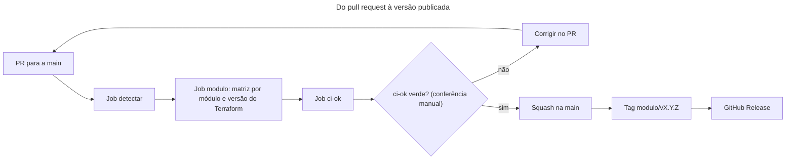
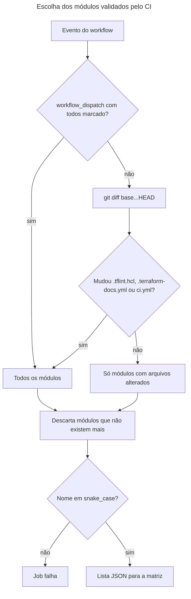

# Pipeline: CI e release dos módulos

## O que o pipeline entrega

Este repositório não implanta nada em ambiente nenhum. O que ele entrega são versões de módulos Terraform. Cada versão é uma tag `<modulo>/vX.Y.Z` na `main`, e quem consome o módulo fixa essa tag no `source` (veja "Como consumir" no [README da raiz](../../README.md#como-consumir)).

São duas partes:

- **CI automático:** o workflow `ci` do GitHub Actions valida os módulos alterados em todo pull request para a `main` (`.github/workflows/ci.yml`).
- **Release manual:** depois do merge, o responsável cria a tag do módulo e a release no GitHub. Nenhum workflow roda em push na `main` ou em tags, então essa parte não tem automação. O passo a passo está no runbook [Publicar uma versão de módulo](../runbooks/publicar-versao-de-modulo.md).

Responsável pelo pipeline e pelo repositório: @FWesleycosta.

## Do pull request à versão publicada

O diagrama mostra o caminho de uma mudança num módulo até a versão publicada. Repare que a conferência do `ci-ok` antes do merge é manual: o merge com o CI vermelho é proibido por convenção, mas o repositório não tem proteção de branch e o GitHub não o bloqueia (veja [Gatilhos e aprovações](#gatilhos-e-aprovações)).

No mesmo PR da mudança entram o `CHANGELOG.md` do módulo, já com a seção da versão nova e a data do merge, e a linha do módulo no índice do README da raiz, com a versão apontando para esse CHANGELOG. No mesmo dia do merge, o responsável publica a tag e a release. Uma tag publicada nunca é apagada nem movida.

### Como o CI escolhe os módulos

O job `detectar` monta a lista de módulos que a matriz vai validar (`ci.yml`, linhas 30 a 100). O diagrama mostra as decisões. O ponto mais importante: mudar a configuração compartilhada da raiz faz o CI validar todos os módulos.

Detalhes:

- A base da comparação é `origin/<branch base do PR>` no `pull_request` e `origin/main` no `workflow_dispatch` (linhas 59 a 64).
- Um módulo é qualquer pasta direta de `modules/` (linha 53).
- O nome precisa casar com `^[a-z][a-z0-9_]*$` (linha 77). Um nome inválido derruba o job com uma mensagem de erro por módulo, em vez de sumir da matriz em silêncio (linhas 91 a 96).
- Se nenhum módulo mudou, por exemplo num PR que só altera `docs/` ou o `README.md`, a lista sai vazia e o job `modulo` é pulado (linha 105).

## Etapas

Referência das etapas do workflow. Todos os caminhos são relativos à raiz do repositório. Os passos do job `modulo` rodam dentro de `modules/<modulo>` (linhas 116 a 118).

| Etapa | O que faz | Onde está definido | Versão do Terraform | Falha bloqueia? |
|---|---|---|---|---|
| Detectar módulos alterados | Monta a lista de módulos da matriz | `ci.yml`, linhas 30 a 100 | Não usa | Sim, faz o `ci-ok` falhar |
| `terraform fmt` | `terraform fmt -check -recursive -diff` | `ci.yml`, linhas 131 e 132 | `~1.11.0` e `latest` | Sim |
| `init` e `validate` do módulo | `init -backend=false` e `validate` | `ci.yml`, linhas 134 a 137 | `~1.11.0` e `latest` | Sim |
| `init` e `validate` dos exemplos | O mesmo para cada pasta em `examples/*/` | `ci.yml`, linhas 139 a 147 | `~1.11.0` e `latest` | Sim |
| `terraform test` | Roda os arquivos `tests/*.tftest.hcl` | `ci.yml`, linhas 149 e 150 | `~1.11.0` e `latest` | Sim |
| TFLint | Regras do `.tflint.hcl`: preset `recommended` e plugin AWS | `ci.yml`, linhas 153 a 166, e `.tflint.hcl` | Só `latest` | Sim |
| Trivy | `trivy config --exit-code 1 --severity HIGH,CRITICAL .` | `ci.yml`, linhas 168 a 177 | Só `latest` | Sim, para achados HIGH e CRITICAL |
| terraform-docs | Confere se o README do módulo está igual ao gerado (`--output-check`) | `ci.yml`, linhas 179 a 193, e `.terraform-docs.yml` | Só `latest` | Sim |
| `ci-ok` | Falha se algum job anterior terminou em `failure` ou `cancelled` | `ci.yml`, linhas 195 a 212 | Não usa | É o resultado consolidado |

Por que duas versões do Terraform: `~1.11.0` é a mínima suportada (`required_version >= 1.11`) e `latest` é a mais recente (linhas 112 a 115). A matriz usa `fail-fast: false` (linha 109), então uma combinação que falha não cancela as outras. TFLint, Trivy e terraform-docs não dependem da versão do Terraform e rodam só na combinação `latest` (linha 152).

O `ci-ok` roda sempre (`if: always()`, linha 200). Job pulado conta como sucesso, então um PR sem módulos alterados termina com o `ci-ok` verde.

As mesmas verificações podem rodar na sua máquina. Os comandos estão em [Validação local](../../README.md#validação-local).

## Gatilhos e aprovações

- **`pull_request` para a `main`** (linhas 4 a 6). É o gatilho normal.
- **`workflow_dispatch`** (linhas 7 a 12), disparado à mão na aba Actions. O input `todos` vem marcado por padrão e valida todos os módulos. Desmarcado, valida só os módulos alterados em relação à `origin/main`.
- **Concorrência** (linhas 17 a 19): um push novo no mesmo PR cancela a execução anterior.

> [!WARNING]
> O merge com o `ci-ok` vermelho é proibido por convenção. Como o repositório é privado, numa conta gratuita, e não tem proteção de branch, o `ci-ok` não é check obrigatório e o GitHub não bloqueia o merge. Confira o `ci-ok` no PR antes de fazer o merge.

- **Merge:** só o squash está habilitado no repositório, e cada PR vira um único commit na `main`. No histórico, a mensagem desse commit é o título do PR seguido do número, por exemplo `feat(aws_s3_bucket): ... (#4)`. Por isso o título do PR precisa seguir o padrão `tipo(<modulo>): ...`: é dele que sai o tipo de versão (veja o [runbook de release](../runbooks/publicar-versao-de-modulo.md)).
- **Aprovação de PR:** sem proteção de branch, nenhuma aprovação é exigida.
- **Tags e releases:** só o responsável cria. Não existe ruleset que proteja as tags.

### Limitação conhecida: `workflow_dispatch` na `main` com `todos` desmarcado

Disparado na própria `main` com `todos` desmarcado, o `git diff origin/main...HEAD` (linha 64) sai vazio. Nenhum módulo é validado e o `ci-ok` termina verde. Para validar a `main`, dispare com `todos` marcado, que é o padrão.

## Credenciais e permissões

- O token do workflow só tem permissão de leitura do conteúdo (`permissions: contents: read`, linhas 14 e 15).
- O checkout não guarda credenciais no repositório clonado (`persist-credentials: false`, linhas 41 e 123).
- O `GITHUB_TOKEN` só é passado ao passo do TFLint (linhas 162 e 163), que o usa no `tflint --init` para baixar o plugin AWS do GitHub.
- O pipeline não acessa nenhuma conta de nuvem. `init` roda com `-backend=false` e não há credenciais de provider configuradas.
- Toda GitHub Action é fixada pelo SHA do commit, com a versão em comentário (linhas 38, 121, 126, 155 e 170).
- O terraform-docs é baixado da release oficial e conferido pelo SHA-256 antes do uso (linhas 26, 27 e 179 a 189).

## Versões das ferramentas e como atualizá-las

| Item | Versão atual | Onde está fixada | Quem atualiza |
|---|---|---|---|
| GitHub Actions (`checkout`, `setup-terraform`, `setup-tflint`, `setup-trivy`) | SHAs em `ci.yml` | `ci.yml`, linhas 38, 121, 126, 155 e 170 | Dependabot, toda semana, num PR agrupado com prefixo `ci` (`.github/dependabot.yml`) |
| TFLint | v0.64.0 | `ci.yml`, linha 23 | Responsável, à mão, a cada trimestre |
| Plugin AWS do TFLint | 0.49.0 | `.tflint.hcl`, linhas 13 a 17 | Responsável, à mão, a cada trimestre |
| Trivy | v0.75.0 | `ci.yml`, linha 24 | Responsável, à mão, a cada trimestre |
| terraform-docs | v0.24.0 | `ci.yml`, linhas 25 a 27 (versão e SHA-256) | Responsável, à mão, a cada trimestre |
| Terraform | `~1.11.0` e `latest` | `ci.yml`, linhas 113 a 115 | `latest` acompanha a versão mais recente sozinho. A mínima muda junto com o `required_version` dos módulos |

Ao atualizar o terraform-docs, troque também o `TERRAFORM_DOCS_SHA256` pelo valor do arquivo `.sha256sum` publicado na release da versão nova.

Qualquer PR que altere o `ci.yml` valida todos os módulos (linha 67), e isso inclui os PRs do Dependabot.

## Como reverter

Uma tag publicada nunca é apagada nem movida. Para desfazer uma versão com problema:

1. Quem consome volta para a versão anterior trocando o `?ref=` do `source` para a tag anterior do módulo e roda `terraform init` de novo.
2. A correção entra num PR novo, como qualquer mudança, e sai como uma versão nova, que segue as regras de [Versionamento](../../README.md#versionamento) do README.

Se o erro estiver na própria tag (commit errado ou número errado), o procedimento está em [Se não resolver](../runbooks/publicar-versao-de-modulo.md#se-não-resolver), no runbook de release: publica-se a versão seguinte correta, e as notas da release errada recebem um aviso.

## Pendências

Nenhuma no momento.

## Referências

GITHUB. **Workflow syntax for GitHub Actions**. Disponível em: https://docs.github.com/actions/reference/workflows-and-actions/workflow-syntax. Acesso em: 6 out. 2026.

GITHUB. **Dependabot options reference**. Disponível em: https://docs.github.com/code-security/dependabot/working-with-dependabot/dependabot-options-reference. Acesso em: 6 out. 2026.

PRESTON-WERNER, Tom. **Versionamento Semântico 2.0.0**. Disponível em: https://semver.org/lang/pt-BR/. Acesso em: 6 out. 2026.
