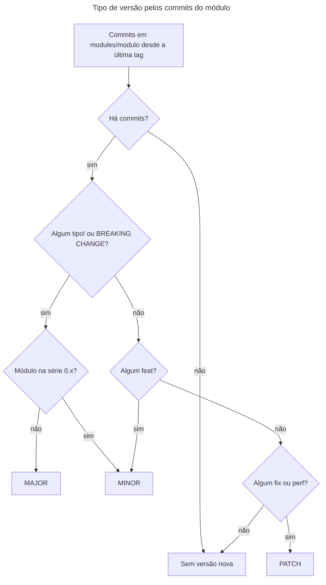

# Runbook: publicar uma versão de módulo

> [!NOTE]
> Quando usar: um PR que altera `modules/<modulo>/` acabou de entrar na `main` e o módulo precisa de uma versão nova. A visão geral do fluxo está em [Pipeline: CI e release dos módulos](../pipelines/ci-e-release-de-modulos.md).

## Antes de começar

- **Quem executa:** só o responsável pelo repositório (@FWesleycosta) cria tags e releases.
- **Acessos necessários:**
  - permissão de escrita no repositório;
  - GitHub CLI (`gh`) autenticado numa conta com acesso ao repositório, que é privado;
  - Git configurado para assinar tags (`tag.gpgSign`). As tags publicadas até hoje são anotadas e assinadas com chave SSH.
- **Impacto esperado:** nenhum sobre quem já consome o módulo. Cada consumidor fixa uma tag no `?ref=` e só recebe a versão nova quando trocar essa referência.
- **Quando executar:** no mesmo dia do merge.
- **O que já precisa estar na `main`,** porque entra no próprio PR do módulo:
  - O `CHANGELOG.md` do módulo com a seção da versão nova (`## [X.Y.Z] - AAAA-MM-DD`), no formato Keep a Changelog. A data é a do merge. Se o merge acontecer num dia diferente do previsto, ajuste a data no PR antes de fazer o merge.
  - A linha do módulo no índice "Módulos" do `README.md` da raiz, com a versão nova na coluna "Versão atual" e link para o CHANGELOG do módulo: `[X.Y.Z](modules/<modulo>/CHANGELOG.md)`. O link aponta para o CHANGELOG, e não para a release, porque a release só passa a existir depois do merge.

> [!WARNING]
> Uma tag publicada (enviada ao `origin`) nunca é apagada nem movida. Confira a versão antes do `git push` da tag. Se uma versão sair com problema, a correção sai como uma versão nova.

## Diagnóstico: confirmar a versão

O tipo de versão sai dos Conventional Commits que tocaram o módulo desde a última tag dele. Com o squash, cada PR é um commit, e a mensagem é o título do PR. O diagrama mostra a decisão. Repare que, na série `0.x`, uma quebra de interface sobe o MINOR, e não o MAJOR. A versão escolhida precisa bater com a que já está registrada no CHANGELOG.



1. Atualize a `main` local:

   ```sh
   git switch main
   git pull
   ```

2. Descubra a última tag do módulo:

   ```sh
   git describe --tags --abbrev=0 --match '<modulo>/v[0-9]*'
   ```

   Esperado: algo como `aws_s3_bucket/v0.1.0`. Se o comando falhar, o módulo nunca foi publicado. Considere a versão base `0.0.0` e, no passo seguinte, liste todos os commits do módulo (`git log --format='%s%n%b' -- modules/<modulo>`).

3. Liste os commits do módulo desde essa tag:

   ```sh
   git log <ultima-tag>..HEAD --format='%s%n%b' -- modules/<modulo>
   ```

4. Aplique a decisão do diagrama sobre a versão base:
   - Algum commit com `!` depois do tipo (ex.: `feat(<modulo>)!:`) ou uma linha `BREAKING CHANGE:` no corpo → MAJOR (`X+1.0.0`). Na série `0.x`, a quebra de interface sobe o MINOR (`0.Y+1.0`). A passagem para `1.0.0` não sai dos commits: é decisão do responsável.
   - Senão, algum `feat` → MINOR (`X.Y+1.0`).
   - Senão, algum `fix` ou `perf` → PATCH (`X.Y.Z+1`).
   - Só `docs`, `chore`, `ci` ou `test` → não publique versão.

   Um módulo novo, sem tag e com um `feat`, sai como `0.1.0`, que é a versão inicial definida no README.

5. Compare com a seção mais recente do `CHANGELOG.md` do módulo. Se não bater, pare: corrija o CHANGELOG (e o índice do README) num PR antes de criar a tag.

## Publicação

1. Crie a tag anotada no commit atual da `main`:

   ```sh
   git tag -a <modulo>/vX.Y.Z -m "<modulo> vX.Y.Z"
   ```

2. Confira se a tag aponta para o commit do PR do módulo:

   ```sh
   git log -1 --format='%h %s' <modulo>/vX.Y.Z
   ```

   Esperado: o commit `tipo(<modulo>): ... (#N)` do merge. Se apontar para outro commit, apague a tag local com `git tag -d <modulo>/vX.Y.Z` e refaça. Enquanto a tag não foi enviada, ela ainda não está publicada.

3. Envie a tag:

   ```sh
   git push origin <modulo>/vX.Y.Z
   ```

4. Copie a seção da versão no `CHANGELOG.md` do módulo para um arquivo temporário fora do repositório. A seção vai do título `## [X.Y.Z] - ...`, sem incluir o título, até antes do título da versão seguinte.

5. Crie a release no GitHub com essas notas:

   ```sh
   gh release create <modulo>/vX.Y.Z --title "<modulo> vX.Y.Z" --notes-file <arquivo> --verify-tag
   ```

   O `--verify-tag` faz o comando falhar se a tag não existir no `origin`. Assim a release não cria uma tag nova por engano.

## Verificação

1. A tag existe no `origin`:

   ```sh
   git ls-remote --tags origin '<modulo>/vX.Y.Z'
   ```

   Esperado: duas linhas, a da tag e a do commit (`^{}`).

2. A release existe e tem as notas certas:

   ```sh
   gh release view <modulo>/vX.Y.Z
   ```

3. No índice do README da raiz, a coluna "Versão atual" do módulo mostra a versão nova, com link para o `CHANGELOG.md` do módulo.

## Se não resolver

- **`gh release create` falhou depois do `git push` da tag:** a tag já está publicada e não pode ser recriada. Corrija a causa (autenticação, arquivo de notas) e rode o passo 5 de novo.
- **Tag errada já enviada ao `origin`** (commit errado ou número errado): a tag nunca é apagada nem movida.
  1. Publique a versão seguinte, já correta, repetindo este runbook desde o diagnóstico.
  2. Acrescente um aviso no início das notas da release errada, dizendo que ela não deve ser usada e qual versão a substitui. Salve as notas completas, já com o aviso, num arquivo temporário e rode:

     ```sh
     gh release edit <modulo>/vX.Y.Z --notes-file <arquivo>
     ```

- **Notas da release erradas:** corrija com o mesmo `gh release edit <modulo>/vX.Y.Z --notes-file <arquivo>`. Editar as notas não muda a tag.
- **Escalonamento:** não há outra pessoa para quem escalar. O responsável pelo repositório (@FWesleycosta) é quem executa este runbook.

## Pendências

Nenhuma decisão em aberto. Fica uma nota de manutenção:

- O script que calcula a próxima versão será versionado no repositório num PR separado. Quando ele entrar, troque os passos 2 a 4 do diagnóstico pela chamada ao script e confira se ele segue a regra da série `0.x` (quebra de interface sobe o MINOR).
